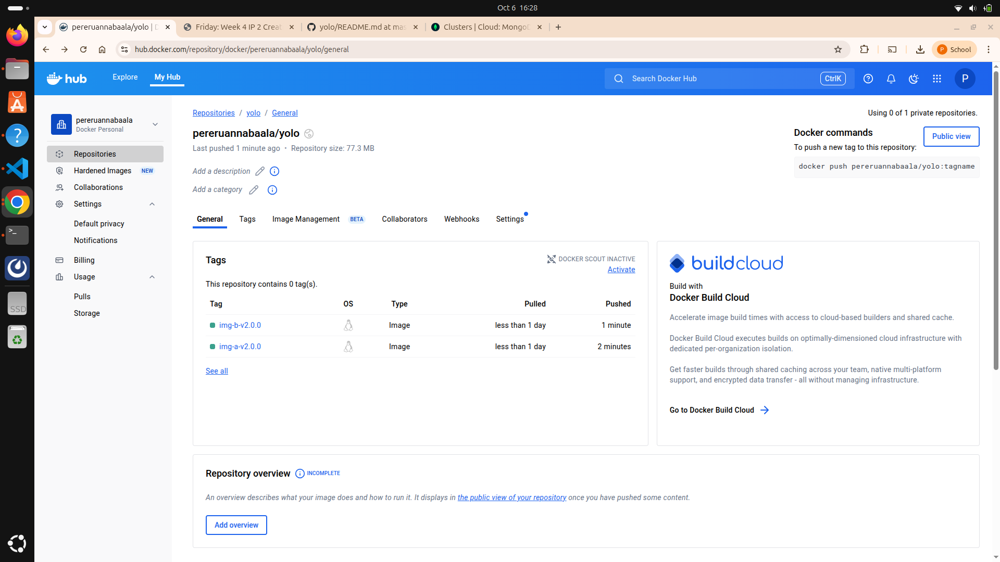
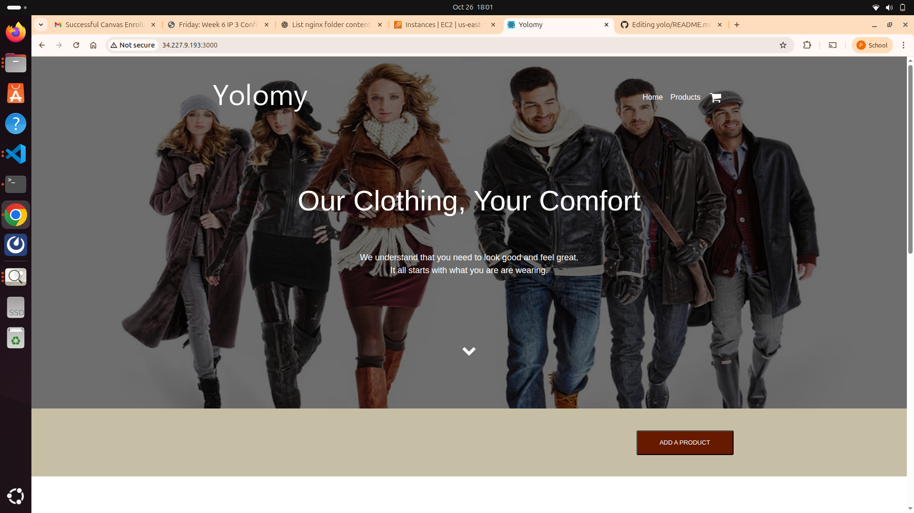

# YOLO E‑Commerce App

A full‑stack e‑commerce web application built with **Node.js / Express**, **MongoDB / Atlas**, and **React** (served via Nginx), containerized with **Docker / Docker Compose**.

---

## 🚀 Features
---
- **Full-stack e-commerce platform** with product management  
- **React frontend** for interactive user interface  
- **Node.js / Express backend** with RESTful API  
- **MongoDB Atlas** for cloud database hosting  
- **Dockerized services** for easy deployment and scalability  
- Designed for **local development** and **cloud deployment** on AWS  
---

## 📂 Repository Structure
```
yolo/
├── backend/                 # Backend (Node.js / Express)
│   ├── server.js
│   ├── routes/api/productRoute.js
│   ├── models/Products.js
│   ├── package.json
│   └── Dockerfile
├── client/                  # Frontend (React)
│   ├── src/
│   ├── public/
│   ├── package.json
│   └── Dockerfile
├── docker-compose.yaml
├── .gitignore
└── README.md

```
---

## 🛠 Setup & Development

### Prerequisites

- Node.js installed (for local development)  
- Docker & Docker Compose installed  
- A MongoDB Atlas cluster with connection URI  
- (Optional) `.env` files for environment configuration  

### Local Setup 

1. Clone the repo:  
   ```bash
   git clone https://github.com/pereruannabaala/yolo.git
   cd yolo

2. Backend setup
```
cd backend
npm install
npm run dev 
```

3. Client setup
```
cd ../client
npm install
npm start
```

## 🐳 Running with Docker Compose

Ensure your `backend/.env` contains a valid `MONGO_URL` and other required environment variables.
From the root directory, run:

```bash
docker compose up
```
This will build and launch:
- **backend** service
- **client** service
The application will then be accessible in your browser at: ``http://localhost:3000``


## 🖼 Image Deployment on DockerHub
Below is a screenshot showing the images successfully pushed to DockerHub:


## 📄 License

This project is licensed under the MIT License. See the [LICENSE](LICENSE) file for details.

---

## 🐳 Badges

  
[](https://hub.docker.com/repository/docker/pereruannabaala/yolo)


# Stage 1: Local Deployment with Ansible & Vagrant

## Objectives
- Deploy the E-Commerce application on a local Vagrant VM.  
- Use Docker containers to run the frontend (React) and backend (Node.js) services.  
- Automate deployment with Ansible roles.  


## Key Components

### Roles
- **Backend Role:** Pulls or builds the backend Docker image, starts the container, exposes port `5000`, and waits for the API health check.  
- **Client Role:** Pulls the frontend Docker image, starts the container on port `3000`, and waits for the frontend to be ready.  

### Variables (`vars/main.yaml`)
Stores all application variables, including:
- Docker image names  
- Container names and ports  
- Docker network name  
- Environment variables  

### Playbook
- Executes the roles sequentially.  
- Ensures Docker network is created and containers are running.  
- Waits for application readiness.  

### Vagrant
- Provides a reproducible local VM environment.  
- Installs Docker and Python for Ansible.  

## Outcome
- Local VM runs both frontend and backend containers.

- Application is accessible via [http://localhost:3000](http://localhost:3000).  
- Full automation is achieved with a single `ansible-playbook playbook.yaml` command.

# Stage 2: AWS Deployment with Terraform & Ansible

## Objectives
- Provision EC2 instances on AWS using Terraform.
  
- Use Ansible to configure the servers and deploy the Dockerized application.  
- Automate the full infrastructure and application deployment workflow.  

## Folder Structure
```
stage-1-Ansible-root/
├── terraform/
│ ├── main.tf
│ ├── variables.tf
│ ├── outputs.tf
│ └── terraform.tfvars
├── roles/
│ ├── backend/
│ └── client/
├── vars/
│ └── main.yaml
```


## Key Components

### Terraform
- **Provider:** AWS configuration (aws provider, region, credentials).  
- **Resources:**  
  - `aws_instance` for backend and frontend servers.  
  - `aws_security_group` allowing HTTP (80), HTTPS (443), SSH (22), and ICMP.  
- **Outputs:** EC2 public IPs and Ansible inventory/playbook references.  
- Automates infrastructure provisioning, which Ansible can then use for configuration.  

### Ansible Integration
- Pulls Docker images and starts containers on EC2 instances.  
- Configures the application environment similar to Stage 1.  
- Playbook triggers both Terraform provisioning and server configuration.  

### Security & Networking
- Security groups configured for proper port access.  
- Docker network ensures communication between frontend and backend containers.  

## Outcome
- EC2 instances are created and configured automatically.  
- Docker containers run on AWS, and the application is publicly accessible via `http://<EC2-public-ip>:3000`.
  
- Full automation from infrastructure provisioning to application deployment.  

## Summary
- **Stage 1:** Local deployment, ideal for development and testing.  
- **Stage 2:** Cloud deployment on AWS, demonstrating Infrastructure as Code and integration of Terraform with Ansible.  

**Best practices followed include:**
- Use of roles and variables in Ansible.  
- Docker containerization for modularity.  
- Secure and reproducible infrastructure provisioning.  
- Automation of end-to-end deployment.

# 🧠 Yolo App - Kubernetes Deployment on AWS EKS

This repository contains the Kubernetes deployment and services configurations for the **Yolo App**, deployed on **Amazon Elastic Kubernetes Service (EKS)**.  
It includes setup instructions, configuration files, and commands for deploying the application, storage, and networking components.

---

## 🚀 Overview

Yolo App is a containerized web application that runs in a Kubernetes cluster managed by AWS EKS.  
This setup leverages:
- **EKS** for cluster management
- **Amazon EBS CSI Driver** for persistent storage
- **LoadBalancer Service** for external access
- **kubectl** and **eksctl** for deployment and configuration

---

## 🏗️ Prerequisites

Before deploying, ensure you have the following installed and configured:

- [AWS CLI](https://docs.aws.amazon.com/cli/latest/userguide/install-cliv2.html)
- [kubectl](https://kubernetes.io/docs/tasks/tools/install-kubectl/)
- [eksctl](https://eksctl.io/introduction/#installation)
- [Docker](https://docs.docker.com/get-docker/)
- An **AWS account** with sufficient IAM permissions
- A **configured AWS CLI profile** (`aws configure`)

---

## ⚙️ Cluster Setup

### 1. Create an EKS Cluster
```bash
eksctl create cluster \
  --name yolo-cluster \
  --region us-east-1 \
  --nodegroup-name standard-workers \
  --node-type t3.medium \
  --nodes 2 \
  --nodes-min 2 \
  --nodes-max 3 \
  --managed


```
### 2. Verify Cluster
```
kubectl get nodes
kubectl cluster-info
```

### 3. Check deployments
```
kubectl get deployment
```

### 4. Get pods
```
kubectl get pods
```

# Exposing Services in Kubernetes

## Accessing External IPs in Minikube vs AWS EKS

### ⚙️ Minikube
When running Kubernetes locally using **Minikube**, `LoadBalancer` services do not automatically get a public external IP because Minikube does not have a built-in cloud load balancer.

To simulate this, you need to run:

```bash
minikube tunnel
```

### Access your deployed services
Run
```
kubectl get svc
```

### Run it the External IP to view your services
``
backend-service   LoadBalancer   10.100.158.213   af4eb36195fc640a1800376783c5d219-58923987.us-east-1.elb.amazonaws.com     5000:30095/TCP
client-service    LoadBalancer   10.100.202.215   ac9e2c97fe5ff4fbb8851d54be580185-1081048613.us-east-1.elb.amazonaws.com   3000:32703/TCP

``

## Author
- Pereruan Nabaala
- pereruannabaala@gmail.com
